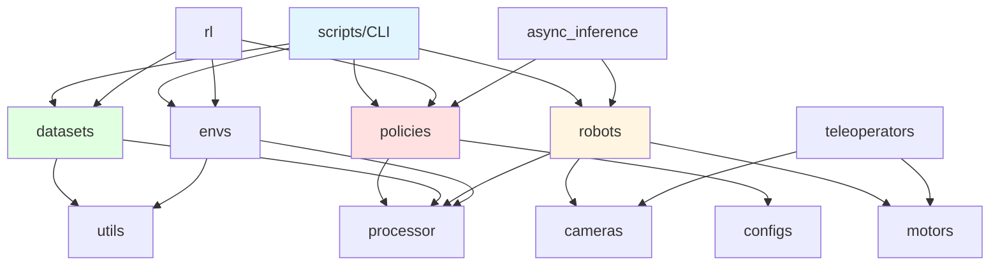
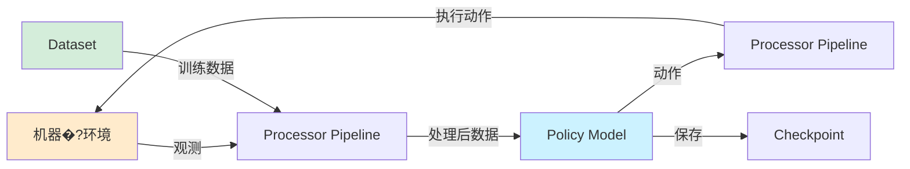
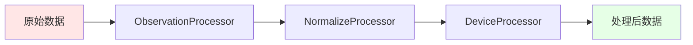

# LeRobot 项目技术文�?
> **版本**: v0.4.4 | **代码库版�?*: v3.0  
> **最后更�?*: 2026-02-15

---

## 📋 目录

- [第一部分：项目架构分析](#第一部分项目架构分析)
  - [1.1 项目整体架构](#11-项目整体架构)
  - [1.2 模块详细说明](#12-模块详细说明)
  - [1.3 代码组织逻辑](#13-代码组织逻辑)
- [第二部分：快速上手指南](#第二部分快速上手指�?
  - [2.1 环境准备](#21-环境准备)
  - [2.2 项目启动流程](#22-项目启动流程)
  - [2.3 训练参数配置](#23-训练参数配置)
- [第三部分：深入学习路线](#第三部分深入学习路线)
  - [3.1 代码阅读顺序](#31-代码阅读顺序)
  - [3.2 核心概念理解](#32-核心概念理解)
  - [3.3 二次开发指南](#33-二次开发指�?

---

## 第一部分：项目架构分�?
### 1.1 项目整体架构

#### 项目目录�?
```
lerobot/
├── src/lerobot/              # 核心源代�?�?  ├── policies/             # 策略模型实现（ACT, Diffusion, VQ-BeT, TDMPC, Gr00t, Pi0等）
�?  ├── datasets/             # 数据集加载与处理
�?  ├── robots/               # 机器人硬件接�?�?  ├── teleoperators/        # 遥操作设�?�?  ├── cameras/              # 相机驱动
�?  ├── motors/               # 电机控制
�?  ├── processor/            # 数据处理管道
�?  ├── envs/                 # 仿真环境（Aloha, PushT, LIBERO, MetaWorld�?�?  ├── rl/                   # 强化学习组件
�?  ├── async_inference/      # 异步推理服务
�?  ├── configs/              # 配置管理
�?  ├── scripts/              # CLI 命令行工�?�?  └── utils/                # 工具函数
├── examples/                 # 示例代码
�?  ├── training/             # 训练示例
�?  ├── tutorial/             # 教程代码
�?  ├── lekiwi/               # LeKiwi 机器人示�?�?  └── phone_to_so100/       # 手机遥操作示�?├── tests/                    # 单元测试
├── docs/                     # 文档
├── benchmarks/               # 性能基准测试
├── docker/                   # Docker 配置
└── pyproject.toml            # 项目配置文件
```


#### 核心模块及职�?
| 模块 | 职责 | 关键技�?|
|------|------|----------|
| **policies/** | 实现各类机器人策略模�?| PyTorch, Transformers, Diffusion Models |
| **datasets/** | 数据集加载、处理、统计计�?| Parquet, MP4, HuggingFace Datasets |
| **robots/** | 统一机器人硬件接�?| Serial, USB, CAN, SDK |
| **teleoperators/** | 遥操作设备驱�?| Gamepad, Keyboard, Phone |
| **cameras/** | 相机驱动与图像采�?| OpenCV, RealSense |
| **motors/** | 电机控制（Dynamixel, Feetech, Damiao�?| Serial Protocol, CAN Bus |
| **processor/** | 数据预处理管�?| Normalization, Tokenization |
| **envs/** | 仿真环境集成 | Gymnasium, MuJoCo |
| **rl/** | 强化学习训练框架 | Actor-Learner, Replay Buffer |
| **scripts/** | CLI 命令行工�?| 训练、评估、数据采�?|

#### 模块依赖关系�?


#### 数据流图



### 1.2 模块详细说明

#### 1.2.1 Policies 模块

**功能描述**：实现多种机器人策略模型，支持模仿学习、强化学习和视觉-语言-动作（VLA）模型�?
**支持的策�?*�?
| 策略 | 类型 | 特点 | 配置文件 |
|------|------|------|----------|
| **ACT** | 模仿学习 | Transformer + CVAE，适合双臂操作 | `configuration_act.py` |
| **Diffusion** | 模仿学习 | 扩散模型，生成平滑轨�?| `configuration_diffusion.py` |
| **VQ-BeT** | 模仿学习 | 向量量化 + Transformer | `configuration_vqbet.py` |
| **TDMPC** | 强化学习 | 模型预测控制 | `configuration_tdmpc.py` |
| **Gr00t** | VLA | NVIDIA 大模型，支持多模�?| `configuration_groot.py` |
| **Pi0/Pi0.5** | VLA | Physical Intelligence 预训练模�?| `configuration_pi0.py` |
| **SmolVLA** | VLA | 轻量级视�?语言-动作模型 | `configuration_smolvla.py` |
| **XVLA** | VLA | 跨模�?VLA 模型 | `configuration_xvla.py` |

**关键�?函数**�?
```python
# src/lerobot/policies/pretrained.py
class PreTrainedPolicy:
    \"\"\"所有策略的基类\"\"\"
    def select_action(self, observation: dict) -> torch.Tensor:
        \"\"\"根据观测选择动作\"\"\"
        pass
    
    def forward(self, batch: dict) -> dict:
        \"\"\"前向传播，用于训练\"\"\"
        pass
```

**接口定义**�?- 输入：`observation` 字典（包含图像、状态等�?- 输出：`ction` 张量（机器人动作�?
#### 1.2.2 Datasets 模块

**功能描述**：LeRobotDataset 格式的数据集加载、处理、可视化和工具�?
**核心�?*�?
```python
# src/lerobot/datasets/lerobot_dataset.py
class LeRobotDataset:
    \"\"\"LeRobot 标准数据集格式\"\"\"
    def __init__(self, repo_id: str, root: Path = None):
        # �?HuggingFace Hub 加载数据�?        pass
    
    def __getitem__(self, idx: int) -> dict:
        # 返回单个样本（自动解码视频）
        pass
```

**数据格式**�?- **视频**：MP4 格式（H.264/HEVC 编码�?- **状�?动作**：Parquet 文件
- **元数�?*：JSON 格式（info.json, stats.json�?
**关键功能**�?- `compute_stats.py`：计算数据集统计信息（均值、标准差�?- `dataset_tools.py`：数据集编辑工具（删除、合并、分割）
- `image_writer.py`：异步图像写�?- `video_utils.py`：视频编解码

#### 1.2.3 Robots 模块

**功能描述**：提供统一�?`Robot` 接口，支持多种硬件平台�?
**基类定义**�?
```python
# src/lerobot/robots/robot.py
class Robot(abc.ABC):
    @abc.abstractmethod
    def connect(self):
        \"\"\"连接机器人\"\"\"
        pass
    
    @abc.abstractmethod
    def get_observation(self) -> RobotObservation:
        \"\"\"获取观测\"\"\"
        pass
    
    @abc.abstractmethod
    def send_action(self, action: RobotAction):
        \"\"\"发送动作\"\"\"
        pass
```

**支持的机器人**�?- SO100/SO101（低成本机械臂）
- Koch（双臂机器人�?- LeKiwi（移动机器人�?- Reachy2（人形机器人�?- Unitree G1（人形机器人�?- OpenARM（开源机械臂�?
#### 1.2.4 Processor 模块

**功能描述**：数据处理管道，负责观测和动作的预处理、后处理�?
**核心组件**�?
```python
# src/lerobot/processor/pipeline.py
class DataProcessorPipeline:
    \"\"\"数据处理管道\"\"\"
    def __init__(self, steps: list[ProcessorStep]):
        self.steps = steps
    
    def __call__(self, data: dict) -> dict:
        for step in self.steps:
            data = step(data)
        return data
```

**常用处理�?*�?- `NormalizeProcessor`：归一�?- `ObservationProcessor`：观测处�?- `DeviceProcessor`：设备转换（CPU/GPU�?- `TokenizerProcessor`：文本分�?
### 1.3 代码组织逻辑

#### 命名规范

- **类名**：大驼峰（`LeRobotDataset`, `PreTrainedPolicy`�?- **函数�?*：小写下划线（`get_observation`, `send_action`�?- **常量**：大写下划线（`CODEBASE_VERSION`, `HF_LEROBOT_HOME`�?- **配置�?*：`Configuration` 后缀（`ACTConfig`, `DiffusionConfig`�?
#### 设计模式

1. **工厂模式**：`actory.py` 文件用于创建对象
   - `policies/factory.py`：创建策�?   - `datasets/factory.py`：创建数据集
   - `envs/factory.py`：创建环�?
2. **注册表模�?*：`ProcessorStepRegistry` 用于注册处理�?
3. **抽象基类**：`Robot`, `PreTrainedPolicy` 定义接口

#### 配置管理

使用 `draccus` 库进行配置管理：

```python
# src/lerobot/configs/train.py
@dataclass
class TrainPipelineConfig:
    policy: PolicyConfig
    dataset: DatasetConfig
    training: TrainingConfig
    eval: EvalConfig
```

---

## 第二部分：快速上手指�?
### 2.1 环境准备

#### 系统要求

- **操作系统**：Windows 10/11, Ubuntu 20.04+, macOS 12+
- **Python**�?= 3.10
- **CUDA**�?= 11.8（可选，用于 GPU 加速）
- **内存**�?= 16GB RAM
- **存储**�?= 50GB 可用空间

#### 依赖项列�?
**核心依赖**�?- PyTorch >= 2.2.1
- Transformers >= 4.57.1
- Datasets >= 4.0.0
- Hugging Face Hub >= 0.34.2
- OpenCV >= 4.9.0

**可选依�?*（根据需求安装）�?- `lerobot[dynamixel]`：Dynamixel 电机支持
- `lerobot[intelrealsense]`：RealSense 相机支持
- `lerobot[aloha]`：Aloha 仿真环境
- `lerobot[groot]`：Gr00t 模型支持
- `lerobot[all]`：所有功�?
#### 环境配置步骤

**步骤 1：安�?Python 环境**

```powershell
# 检�?Python 版本
python --version

# 创建虚拟环境（推荐）
python -m venv lerobot_env

# 激活虚拟环�?.\lerobot_env\Scripts\activate
```

**步骤 2：安�?LeRobot**

```powershell
# 基础安装
pip install lerobot

# 或从源码安装（开发模式）
git clone https://github.com/huggingface/lerobot.git
cd lerobot
pip install -e .

# 安装特定功能
pip install lerobot[aloha]  # 仿真环境
pip install lerobot[groot]  # Gr00t 模型
```

**步骤 3：验证安�?*

```powershell
# 查看版本信息
lerobot-info

# 输出示例�?# LeRobot version: 0.4.4
# Python version: 3.10.x
# PyTorch version: 2.2.1
```

#### 常见问题与解决方�?
💡 **问题 1：CUDA 不可�?*

```powershell
# 检�?CUDA 是否可用
python -c "import torch; print(torch.cuda.is_available())"

# 解决方案：安装对�?CUDA 版本�?PyTorch
pip install torch torchvision --index-url https://download.pytorch.org/whl/cu118
```

💡 **问题 2：相机驱动安装失�?*

```powershell
# RealSense 相机需要额外驱�?# Windows: 下载 Intel RealSense SDK
# https://github.com/IntelRealSense/librealsense/releases
```

⚠️ **问题 3：权限错误（串口访问�?*

```powershell
# Windows: 以管理员身份运行
# Linux: 添加用户�?dialout �?sudo usermod -a -G dialout $USER
```

**检查清�?*�?- [ ] Python >= 3.10 已安�?- [ ] LeRobot 安装成功
- [ ] `lerobot-info` 命令可执�?- [ ] PyTorch 可正常导�?- [ ] CUDA 可用（如需 GPU�?

### 2.2 项目启动流程

#### 场景 1：加载预训练模型进行推理

```powershell
# �?HuggingFace Hub 加载预训练模�?python -c "
from lerobot.policies.pretrained import PreTrainedPolicy

# 加载 ACT 策略
policy = PreTrainedPolicy.from_pretrained('lerobot/act_aloha_sim_transfer_cube_human')

# 准备观测数据
import torch
observation = {
    'observation.images.top': torch.randn(1, 3, 480, 640),
    'observation.state': torch.randn(1, 14)
}

# 推理
action = policy.select_action(observation)
print(f'Action shape: {action.shape}')
"
```

#### 场景 2：在仿真环境中评估策�?
```powershell
# 评估 ACT 策略�?Aloha 环境
lerobot-eval \
  --policy.path=lerobot/act_aloha_sim_transfer_cube_human \
  --env.type=aloha \
  --env.task=AlohaTransferCube-v0 \
  --eval.n_episodes=10 \
  --eval.batch_size=10
```

**参数说明**�?- `--policy.path`：模型路径（本地�?Hub�?- `--env.type`：环境类型（aloha, pusht, libero, metaworld�?- `--env.task`：任务名�?- `--eval.n_episodes`：评估回合数
- `--eval.batch_size`：批次大�?
#### 场景 3：训练新策略

```powershell
# 训练 ACT 策略
lerobot-train \
  --policy=act \
  --dataset.repo_id=lerobot/aloha_sim_transfer_cube_human \
  --training.offline_steps=100000 \
  --training.batch_size=8 \
  --training.lr=1e-4 \
  --training.save_checkpoint=True \
  --training.save_freq=10000 \
  --output_dir=outputs/act_training
```

**关键参数**�?- `--policy`：策略类型（act, diffusion, vqbet, tdmpc�?- `--dataset.repo_id`：数据集 ID
- `--training.offline_steps`：训练步�?- `--training.batch_size`：批次大�?- `--training.lr`：学习率
- `--output_dir`：输出目�?
#### 场景 4：数据采集（真实机器人）

```powershell
# 步骤 1：查找相�?lerobot-find-cameras

# 步骤 2：查找电机端�?lerobot-find-port

# 步骤 3：校准电�?lerobot-calibrate --robot=so100

# 步骤 4：遥操作测试
lerobot-teleoperate --robot=so100 --teleop=gamepad

# 步骤 5：记录数�?lerobot-record \
  --robot=so100 \
  --fps=30 \
  --repo-id=my_username/my_dataset \
  --num-episodes=50 \
  --warmup-time-s=3 \
  --episode-time-s=30 \
  --reset-time-s=5
```

#### 场景 5：可视化数据�?
```powershell
# 启动数据集可视化工具
lerobot-dataset-viz --repo-id=lerobot/aloha_sim_transfer_cube_human

# 在浏览器中打开 http://localhost:8000
```

#### 多场景启动配置实�?
**配置文件示例**（`config.yaml`）：

```yaml
# 训练配置
policy:
  name: act
  n_obs_steps: 1
  chunk_size: 100
  n_action_steps: 100

dataset:
  repo_id: lerobot/aloha_sim_transfer_cube_human
  image_transforms:
    enable: true
    max_num_transforms: 3

training:
  offline_steps: 100000
  batch_size: 8
  lr: 1e-4
  lr_scheduler: cosine
  grad_clip_norm: 10
  save_checkpoint: true
  save_freq: 10000

eval:
  n_episodes: 10
  batch_size: 10
```

**使用配置文件**�?
```powershell
lerobot-train --config=config.yaml
```

**检查清�?*�?- [ ] 模型加载成功
- [ ] 数据集可访问
- [ ] GPU 可用（如需要）
- [ ] 输出目录已创�?- [ ] 日志正常输出

### 2.3 训练参数配置

#### 核心训练参数

| 参数 | 默认�?| 取值范�?| 功能影响 |
|------|--------|----------|----------|
| `offline_steps` | 100000 | 10000-1000000 | 训练总步数，影响模型收敛 |
| `batch_size` | 8 | 1-128 | 批次大小，影响显存占用和训练稳定�?|
| `lr` | 1e-4 | 1e-6 - 1e-3 | 学习率，过大导致不稳定，过小收敛�?|
| `grad_clip_norm` | 10 | 1-100 | 梯度裁剪，防止梯度爆�?|
| `eval_freq` | 10000 | 1000-50000 | 评估频率 |
| `save_freq` | 10000 | 1000-50000 | 保存检查点频率 |

#### 策略特定参数

**ACT 策略**�?
```yaml
policy:
  name: act
  n_obs_steps: 1          # 观测历史长度
  chunk_size: 100         # 动作序列长度
  n_action_steps: 100     # 预测动作步数
  dim_model: 512          # Transformer 维度
  n_heads: 8              # 注意力头�?  dim_feedforward: 3200   # 前馈网络维度
  n_encoder_layers: 4     # 编码器层�?  n_decoder_layers: 7     # 解码器层�?  kl_weight: 10.0         # KL 散度权重
```

**Diffusion 策略**�?
```yaml
policy:
  name: diffusion
  n_obs_steps: 2          # 观测历史长度
  horizon: 16             # 预测时域
  n_action_steps: 8       # 执行动作步数
  num_inference_steps: 10 # 推理扩散步数
  down_dims: [256, 512, 1024]  # U-Net 下采样维�?```

**VQ-BeT 策略**�?
```yaml
policy:
  name: vqbet
  n_obs_steps: 1
  chunk_size: 100
  n_vqvae_training_steps: 20000  # VQ-VAE 预训练步�?  vq_n_embed: 16          # 码本大小
  vq_embed_dim: 256       # 嵌入维度
```

#### 常用参数模板

**快速原型（小数据集�?*�?
```yaml
training:
  offline_steps: 10000
  batch_size: 16
  lr: 3e-4
  eval_freq: 1000
  save_freq: 5000
```

**标准训练（中等数据集�?*�?
```yaml
training:
  offline_steps: 100000
  batch_size: 8
  lr: 1e-4
  eval_freq: 10000
  save_freq: 10000
```

**大规模训练（大数据集�?*�?
```yaml
training:
  offline_steps: 500000
  batch_size: 32
  lr: 5e-5
  lr_scheduler: cosine
  warmup_steps: 5000
  eval_freq: 25000
  save_freq: 25000
  use_amp: true  # 混合精度训练
```

#### 调优建议与最佳实�?
💡 **学习率调�?*�?- �?`1e-4` 开�?- 观察损失曲线，如果震荡降低学习率
- 使用学习率调度器（cosine, linear�?
💡 **批次大小选择**�?- GPU 显存 8GB：`atch_size=4`
- GPU 显存 16GB：`atch_size=8`
- GPU 显存 24GB+：`atch_size=16-32`

💡 **数据增强**�?
```yaml
dataset:
  image_transforms:
    enable: true
    max_num_transforms: 3
    random_crop: true
    brightness: [0.8, 1.2]
    contrast: [0.8, 1.2]
```

⚠️ **常见陷阱**�?- 学习率过大导致训练不稳定
- 批次大小过小导致梯度噪声�?- 未使用梯度裁剪导致梯度爆�?- 评估频率过低错过最佳模�?
**检查清�?*�?- [ ] 学习率设置合�?- [ ] 批次大小适配显存
- [ ] 梯度裁剪已启�?- [ ] 评估和保存频率合�?- [ ] 数据增强配置正确

---

## 第三部分：深入学习路�?
### 3.1 代码阅读顺序

#### 推荐阅读路径

**阶段 1：理解数据流�?-2 天）**

1. `src/lerobot/datasets/lerobot_dataset.py` - 数据集加�?2. `src/lerobot/processor/pipeline.py` - 数据处理管道
3. `examples/dataset/load_lerobot_dataset.py` - 数据加载示例

**学习目标**�?- 理解 LeRobotDataset 格式
- 掌握数据加载流程
- 了解数据预处理步�?
**阶段 2：掌握策略模型（3-5 天）**

1. `src/lerobot/policies/pretrained.py` - 策略基类
2. `src/lerobot/policies/act/modeling_act.py` - ACT 模型实现
3. `src/lerobot/policies/diffusion/modeling_diffusion.py` - Diffusion 模型
4. `examples/tutorial/act/act_training_example.py` - 训练示例

**学习目标**�?- 理解策略接口设计
- 掌握 ACT �?Diffusion 原理
- 能够训练和评估模�?
**阶段 3：机器人控制�?-3 天）**

1. `src/lerobot/robots/robot.py` - 机器人基�?2. `src/lerobot/robots/so_follower/so_follower.py` - SO100 实现
3. `src/lerobot/motors/motors_bus.py` - 电机控制
4. `examples/phone_to_so100/teleoperate.py` - 遥操作示�?
**学习目标**�?- 理解机器人接�?- 掌握电机控制原理
- 能够进行遥操作和数据采集

**阶段 4：训练流程（2-3 天）**

1. `src/lerobot/scripts/lerobot_train.py` - 训练脚本
2. `src/lerobot/configs/train.py` - 训练配置
3. `src/lerobot/utils/train_utils.py` - 训练工具
4. `examples/training/train_policy.py` - 训练示例

**学习目标**�?- 理解完整训练流程
- 掌握配置管理
- 能够自定义训练逻辑

#### 必读文件

| 文件 | 重要�?| 说明 |
|------|--------|------|
| `src/lerobot/__init__.py` | ⭐⭐⭐⭐�?| 项目入口，了解可用组�?|
| `src/lerobot/policies/pretrained.py` | ⭐⭐⭐⭐�?| 策略基类，核心接�?|
| `src/lerobot/datasets/lerobot_dataset.py` | ⭐⭐⭐⭐�?| 数据集实�?|
| `src/lerobot/robots/robot.py` | ⭐⭐⭐⭐ | 机器人接�?|
| `src/lerobot/processor/pipeline.py` | ⭐⭐⭐⭐ | 数据处理管道 |

#### 可选文件（按需阅读�?
- `src/lerobot/rl/` - 强化学习相关
- `src/lerobot/async_inference/` - 异步推理
- `src/lerobot/envs/` - 仿真环境
- `benchmarks/` - 性能测试

### 3.2 核心概念理解

#### 关键术语解释

| 术语 | 解释 |
|------|------|
| **Episode** | 一个完整的任务执行序列，从初始状态到终止状�?|
| **Observation** | 机器人的观测数据（图像、关节状态等�?|
| **Action** | 机器人的动作（关节位置、速度等） |
| **Chunk** | 动作序列片段，ACT 模型一次预测多个动�?|
| **Processor** | 数据处理器，负责归一化、转换等操作 |
| **Policy** | 策略模型，从观测映射到动�?|
| **Teleoperator** | 遥操作设备，用于人类示教 |

#### 核心算法：ACT (Action Chunking Transformer)

**原理**�?- 使用 Transformer 编码器处理观�?- CVAE（条件变分自编码器）学习动作分布
- 一次预测多个未来动作（chunk�?
**数学表示**�?
\\\
观测: o_t = {图像, 状态}
动作序列: a_{t:t+T} = [a_t, a_{t+1}, ..., a_{t+T}]
策略: π(a_{t:t+T} | o_t, z)
其中 z ~ N(μ(o_t), σ(o_t))
\\\

**代码实现**�?
```python
# src/lerobot/policies/act/modeling_act.py
class ACTPolicy(PreTrainedPolicy):
    def forward(self, batch):
        # 编码观测
        obs_features = self.encoder(batch['observation'])
        
        # CVAE 编码动作
        mu, log_sigma = self.vae_encoder(batch['action'])
        z = mu + torch.exp(log_sigma) * torch.randn_like(mu)
        
        # 解码动作序列
        action_pred = self.decoder(obs_features, z)
        
        return {'action': action_pred, 'mu': mu, 'log_sigma': log_sigma}
```

#### 核心算法：Diffusion Policy

**原理**�?- 将动作生成建模为扩散过程
- 从噪声逐步去噪得到动作
- 使用 U-Net 预测噪声

**扩散过程**�?
\\\
前向过程: a_t = �?α_t) * a_0 + �?1-α_t) * ε
反向过程: a_{t-1} = (a_t - �?1-α_t) * ε_θ(a_t, o, t)) / �?α_t)
\\\

#### 数据处理管道

**Pipeline 工作流程**�?


**示例代码**�?
```python
from lerobot.processor import DataProcessorPipeline
from lerobot.processor import NormalizeProcessor, DeviceProcessor

# 创建处理管道
pipeline = DataProcessorPipeline([
    NormalizeProcessor(stats={'mean': 0.5, 'std': 0.5}),
    DeviceProcessor(device='cuda')
])

# 处理数据
processed_data = pipeline(raw_data)
```

#### 理论基础与参考资�?
**论文**�?- ACT: [Learning Fine-Grained Bimanual Manipulation with Low-Cost Hardware](https://arxiv.org/abs/2304.13705)
- Diffusion Policy: [Diffusion Policy: Visuomotor Policy Learning via Action Diffusion](https://arxiv.org/abs/2303.04137)
- VQ-BeT: [Behavior Generation with Latent Actions](https://arxiv.org/abs/2403.03181)

**推荐资源**�?- [LeRobot 官方文档](https://huggingface.co/docs/lerobot)
- [Robot Learning Tutorial](https://huggingface.co/spaces/lerobot/robot-learning-tutorial)
- [同济子豪兄中文教程](https://zihao-ai.feishu.cn/wiki/space/7589642043471924447)


### 3.3 二次开发指�?
#### 可扩展点

**1. 自定义策略模�?*

创建新策略需要实现以下接口：

```python
# my_policy/modeling_my_policy.py
from lerobot.policies.pretrained import PreTrainedPolicy

class MyPolicy(PreTrainedPolicy):
    name = "my_policy"
    
    def __init__(self, config):
        super().__init__(config)
        # 初始化模型组�?        self.encoder = ...
        self.decoder = ...
    
    def forward(self, batch: dict) -> dict:
        \"\"\"训练时的前向传播\"\"\"
        obs = batch['observation']
        action = batch['action']
        
        # 模型计算
        pred_action = self.decoder(self.encoder(obs))
        
        # 计算损失
        loss = F.mse_loss(pred_action, action)
        
        return {'loss': loss, 'action': pred_action}
    
    def select_action(self, observation: dict) -> torch.Tensor:
        \"\"\"推理时选择动作\"\"\"
        with torch.no_grad():
            obs_tensor = self._prepare_observation(observation)
            action = self.decoder(self.encoder(obs_tensor))
        return action
```

**配置�?*�?
```python
# my_policy/configuration_my_policy.py
from dataclasses import dataclass
from lerobot.configs.policies import PolicyConfig

@dataclass
class MyPolicyConfig(PolicyConfig):
    name: str = "my_policy"
    hidden_dim: int = 256
    num_layers: int = 4
```

**注册策略**�?
```python
# my_policy/__init__.py
from lerobot.policies.factory import register_policy
from .modeling_my_policy import MyPolicy
from .configuration_my_policy import MyPolicyConfig

register_policy("my_policy", MyPolicy, MyPolicyConfig)
```

**2. 自定义机器人**

```python
# my_robot/my_robot.py
from lerobot.robots.robot import Robot
from lerobot.robots.config import RobotConfig

class MyRobot(Robot):
    name = "my_robot"
    config_class = RobotConfig
    
    def connect(self):
        \"\"\"连接机器人硬件\"\"\"
        # 初始化串口、网络连接等
        self.serial = Serial('/dev/ttyUSB0', 115200)
    
    def disconnect(self):
        \"\"\"断开连接\"\"\"
        self.serial.close()
    
    def get_observation(self) -> dict:
        \"\"\"获取观测\"\"\"
        # 读取传感器数�?        joint_positions = self._read_joint_positions()
        images = self._capture_images()
        
        return {
            'observation.state': joint_positions,
            'observation.images.cam0': images
        }
    
    def send_action(self, action: torch.Tensor):
        \"\"\"发送动作\"\"\"
        # 转换为硬件指�?        joint_commands = action.cpu().numpy()
        self._write_joint_commands(joint_commands)
    
    @property
    def observation_features(self) -> dict:
        return {
            'observation.state': (6,),  # 6 个关�?            'observation.images.cam0': (480, 640, 3)
        }
```

**3. 自定义数据处理器**

```python
# my_processor.py
from lerobot.processor.core import ProcessorStep
from lerobot.processor.pipeline import ProcessorStepRegistry

@ProcessorStepRegistry.register("my_processor")
class MyProcessor(ProcessorStep):
    def __init__(self, param1: float = 1.0):
        self.param1 = param1
    
    def __call__(self, data: dict) -> dict:
        # 自定义处理逻辑
        data['processed_value'] = data['raw_value'] * self.param1
        return data
    
    def to_dict(self) -> dict:
        return {'param1': self.param1}
    
    @classmethod
    def from_dict(cls, config: dict):
        return cls(**config)
```

#### 贡献规范与开发流�?
**开发环境设�?*�?
```powershell
# 克隆仓库
git clone https://github.com/huggingface/lerobot.git
cd lerobot

# 安装开发依�?pip install -e .[dev,test]

# 安装 pre-commit hooks
pre-commit install
```

**代码规范**�?
1. **格式�?*：使�?Ruff 进行代码格式�?
```powershell
# 格式化代�?ruff format .

# 检查代码风�?ruff check .
```

2. **类型注解**：使�?mypy 进行类型检�?
```powershell
mypy src/lerobot
```

3. **文档字符�?*：使�?Google 风格

```python
def my_function(param1: int, param2: str) -> bool:
    \"\"\"简短描述函数功能�?    
    详细描述函数的行为和用途�?    
    Args:
        param1: 参数1的描�?        param2: 参数2的描�?    
    Returns:
        返回值的描述
    
    Raises:
        ValueError: 何时抛出此异�?    \"\"\"
    pass
```

**提交流程**�?
1. 创建分支

```powershell
git checkout -b feature/my-new-feature
```

2. 编写代码和测�?
```python
# tests/test_my_feature.py
import pytest
from lerobot.my_module import my_function

def test_my_function():
    result = my_function(param1=10, param2="test")
    assert result == expected_value
```

3. 运行测试

```powershell
pytest tests/test_my_feature.py -v
```

4. 提交代码

```powershell
git add .
git commit -m "feat: add my new feature"
git push origin feature/my-new-feature
```

5. 创建 Pull Request

#### 调试技�?
**1. 使用 Rerun 可视�?*

```python
import rerun as rr

# 初始�?Rerun
rr.init("my_debug_session", spawn=True)

# 记录数据
rr.log("observation/image", rr.Image(image))
rr.log("action", rr.Scalar(action_value))
```

**2. 数据集调�?*

```powershell
# 可视化数据集
lerobot-dataset-viz --repo-id=my_dataset

# 检查数据集统计
python -c "
from lerobot.datasets import LeRobotDataset
dataset = LeRobotDataset('my_dataset')
print(dataset.stats)
"
```

**3. 策略调试**

```python
# 启用详细日志
import logging
logging.basicConfig(level=logging.DEBUG)

# 检查模型输�?policy.eval()
with torch.no_grad():
    output = policy(batch)
    print(f"Output keys: {output.keys()}")
    print(f"Action shape: {output['action'].shape}")
```

**4. 使用 debugpy 远程调试**

```python
# 在代码中插入断点
import debugpy
debugpy.listen(5678)
print("Waiting for debugger...")
debugpy.wait_for_client()
```

#### 测试方法

**单元测试**�?
```python
# tests/test_my_policy.py
import pytest
import torch
from lerobot.policies.my_policy import MyPolicy

@pytest.fixture
def policy():
    config = MyPolicyConfig()
    return MyPolicy(config)

def test_forward_pass(policy):
    batch = {
        'observation': torch.randn(8, 3, 224, 224),
        'action': torch.randn(8, 6)
    }
    output = policy(batch)
    assert 'loss' in output
    assert output['action'].shape == (8, 6)

def test_select_action(policy):
    observation = {'image': torch.randn(1, 3, 224, 224)}
    action = policy.select_action(observation)
    assert action.shape == (1, 6)
```

**集成测试**�?
```python
# tests/integration/test_training.py
def test_training_pipeline():
    # 创建小数据集
    dataset = create_dummy_dataset()
    
    # 训练几步
    policy = MyPolicy(config)
    for batch in dataset:
        output = policy(batch)
        loss = output['loss']
        loss.backward()
    
    # 验证模型更新
    assert policy.encoder.weight.grad is not None
```

#### 二次开发示�?
**示例 1：添加新的图像增�?*

```python
# my_transforms.py
from lerobot.datasets.transforms import ImageTransform

class MyCustomTransform(ImageTransform):
    def __init__(self, strength: float = 0.5):
        self.strength = strength
    
    def __call__(self, image: np.ndarray) -> np.ndarray:
        # 自定义图像处�?        processed = image * self.strength
        return processed.astype(np.uint8)

# 使用
from lerobot.datasets import LeRobotDataset

dataset = LeRobotDataset(
    "my_dataset",
    image_transforms=[MyCustomTransform(strength=0.8)]
)
```

**示例 2：自定义评估指标**

```python
# my_metrics.py
def compute_success_rate(predictions, ground_truth, threshold=0.05):
    \"\"\"计算成功率\"\"\"
    errors = torch.abs(predictions - ground_truth)
    success = (errors < threshold).all(dim=-1)
    return success.float().mean().item()

# 在评估中使用
from lerobot.scripts.lerobot_eval import eval_policy

results = eval_policy(
    policy=policy,
    env=env,
    n_episodes=50,
    custom_metrics={'success_rate': compute_success_rate}
)
print(f"Success rate: {results['success_rate']:.2%}")
```

**示例 3：实现自定义学习率调度器**

```python
# my_scheduler.py
from torch.optim.lr_scheduler import _LRScheduler

class WarmupCosineScheduler(_LRScheduler):
    def __init__(self, optimizer, warmup_steps, total_steps):
        self.warmup_steps = warmup_steps
        self.total_steps = total_steps
        super().__init__(optimizer)
    
    def get_lr(self):
        if self.last_epoch < self.warmup_steps:
            # 线性预�?            alpha = self.last_epoch / self.warmup_steps
        else:
            # 余弦退�?            progress = (self.last_epoch - self.warmup_steps) / (self.total_steps - self.warmup_steps)
            alpha = 0.5 * (1 + math.cos(math.pi * progress))
        
        return [base_lr * alpha for base_lr in self.base_lrs]

# 使用
optimizer = torch.optim.Adam(policy.parameters(), lr=1e-3)
scheduler = WarmupCosineScheduler(optimizer, warmup_steps=1000, total_steps=100000)
```

**检查清�?*�?- [ ] 代码符合 PEP 8 规范
- [ ] 添加了类型注�?- [ ] 编写了单元测�?- [ ] 添加了文档字符串
- [ ] 通过�?pre-commit 检�?- [ ] 更新了相关文�?
---

## 附录

### A. 常用命令速查

| 命令 | 功能 |
|------|------|
| `lerobot-info` | 查看版本信息 |
| `lerobot-find-cameras` | 查找可用相机 |
| `lerobot-find-port` | 查找串口设备 |
| `lerobot-calibrate` | 校准机器�?|
| `lerobot-teleoperate` | 遥操作机器人 |
| `lerobot-record` | 记录数据�?|
| `lerobot-replay` | 回放数据�?|
| `lerobot-train` | 训练策略 |
| `lerobot-eval` | 评估策略 |
| `lerobot-dataset-viz` | 可视化数据集 |

### B. 配置文件模板

**完整训练配置**（`	rain_config.yaml`）：

```yaml
# 策略配置
policy:
  name: act
  n_obs_steps: 1
  chunk_size: 100
  n_action_steps: 100
  dim_model: 512
  n_heads: 8
  dim_feedforward: 3200
  n_encoder_layers: 4
  n_decoder_layers: 7
  kl_weight: 10.0

# 数据集配�?dataset:
  repo_id: lerobot/aloha_sim_transfer_cube_human
  root: null
  split: train
  image_transforms:
    enable: true
    max_num_transforms: 3
    random_crop: true
    brightness: [0.8, 1.2]
    contrast: [0.8, 1.2]

# 训练配置
training:
  offline_steps: 100000
  batch_size: 8
  lr: 1e-4
  lr_scheduler: cosine
  warmup_steps: 1000
  grad_clip_norm: 10
  weight_decay: 1e-4
  save_checkpoint: true
  save_freq: 10000
  log_freq: 100
  use_amp: false

# 评估配置
eval:
  n_episodes: 10
  batch_size: 10
  use_async_envs: false

# 输出配置
output_dir: outputs/act_training
wandb:
  enable: true
  project: lerobot
  entity: my_username
```

### C. 故障排查指南

| 问题 | 可能原因 | 解决方案 |
|------|----------|----------|
| 训练损失不下�?| 学习率过�?过小 | 调整学习率，尝试 1e-5 �?1e-3 |
| GPU 内存溢出 | 批次大小过大 | 减小 batch_size 或启用梯度累�?|
| 数据加载�?| 视频解码瓶颈 | 增加 num_workers 或使用图像格�?|
| 机器人连接失�?| 端口权限/驱动问题 | 检查设备管理器，更新驱�?|
| 模型推理�?| 未使�?GPU | 确保 `device='cuda'` |

### D. 性能优化建议

**训练加�?*�?
```yaml
# 使用混合精度训练
training:
  use_amp: true

# 增加数据加载线程
dataset:
  num_workers: 4
  prefetch_factor: 2

# 使用梯度累积
training:
  batch_size: 4
  gradient_accumulation_steps: 2  # 等效 batch_size=8
```

**推理加�?*�?
```python
# 使用 TorchScript
policy_scripted = torch.jit.script(policy)

# 使用半精�?policy.half()

# 批量推理
actions = policy.select_action_batch(observations)
```

### E. 资源链接

- **官方网站**: https://huggingface.co/lerobot
- **GitHub**: https://github.com/huggingface/lerobot
- **文档**: https://huggingface.co/docs/lerobot
- **Discord**: https://discord.gg/q8Dzzpym3f
- **论坛**: https://discuss.huggingface.co/c/lerobot
- **中文教程**: https://zihao-ai.feishu.cn/wiki/space/7589642043471924447

---

## 总结

本文档涵盖了 LeRobot 项目的完整技术架构、快速上手指南和深入学习路线。通过本文档，您应该能够：

�?理解 LeRobot 的整体架构和模块职责  
�?快速搭建开发环境并运行示例  
�?掌握训练、评估和数据采集流程  
�?进行二次开发和自定义扩�? 

如有问题，请参考官方文档或�?Discord 社区寻求帮助�?
**文档版本**: v1.0  
**最后更�?*: 2026-02-15  
**维护�?*: LeRobot Community

---

**License**: Apache 2.0  
**Copyright**: © 2024-2026 Hugging Face Inc.
